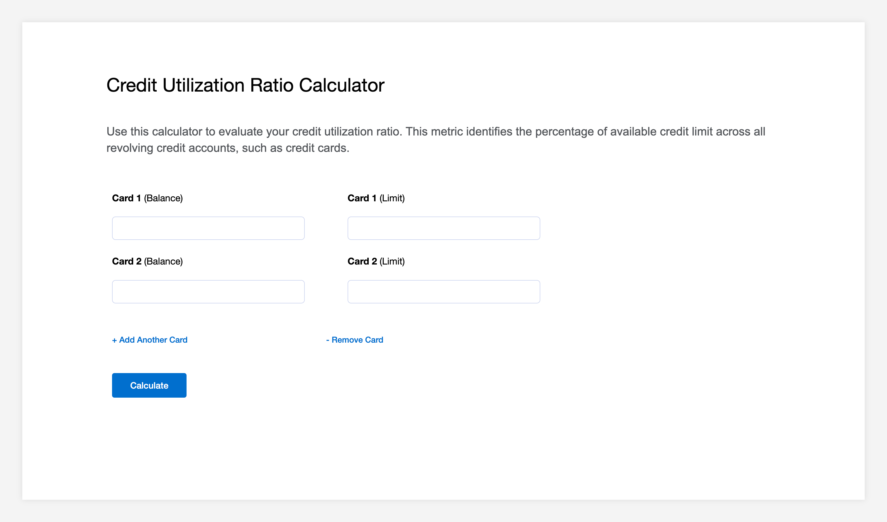

 | 

# Credit Utilization App

## What it does:
This app calculates credit utilization using current credit card balance and limit.
Users may add up to 5 credit cards by clicking the '+card' button.
When all information has been added, the total and individual credit utilizations are calculated.
Individual credit utilization is the the percent utilization for a single card, while
total credit utilization is percentage utilization across all credit cards

Credit utilizations greater than 30% will be displayed in red text, since this is the recommended max.

## How it works:
The calculations are derived with the following formulas:

    Individual:
    (balance * 100) / limit

    Total:
    (total balance * 100) / total limit

    EXAMPLE:
    card 1 - balance: 100, limit: 1000
    card 2 - balance: 200, limit: 2400
    card 3 - balance: 300, limit: 4000

    card 1 utilization: (100 * 100) / 1000 = 10.00%
    card 2 utilization: (200 * 100) / 2400 =  8.33%
    card 3 utilization: (300 * 100) / 4000 =  7.50%

    total utilization: [(100 + 200 + 300) * 100] / (1000 + 2400 + 4000) = 8.11%

## Installation steps:

navigate to directory  
`cd credit-utilization-calculator-main`

install dependencies  
`npm install`

run the app in development mode  
`npm start`
